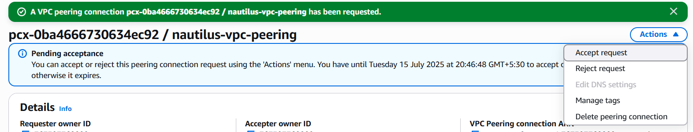
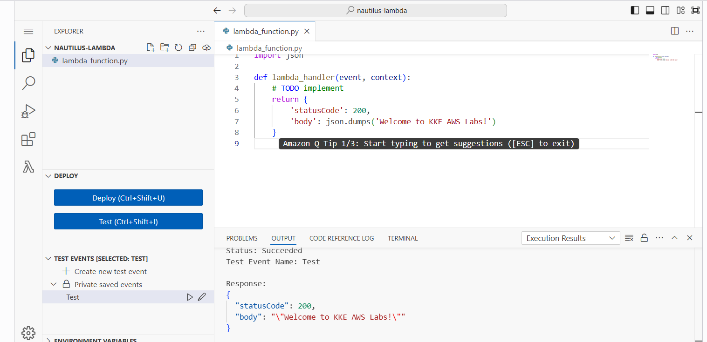
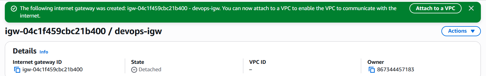

# AWS Level 2 Tasks - Nautilus DevOps Project

This README documents the AWS Level 2 tasks completed as part of the Nautilus DevOps migration project. Each task includes step-by-step instructions for execution via the AWS Management Console unless specified otherwise.

---

## Task List with Steps

### 1: Launch EC2 and Attach Elastic IP
```sh
Go to EC2 → Launch Instance → AMI: Ubuntu → t2.micro → Name: xfusion-ec2.
Create new Elastic IP: Name xfusion-eip.
Associate the EIP with the EC2 instance.
```
---
### 2: Expand EC2 Volume from 8 GiB to 12 GiB
1. Go to **EC2 → Instances → nautilus-ec2**.
2. Note the **Volume ID** under the "Storage" tab.
3. Go to **EC2 → Volumes → Select Volume ID**.
4. Choose **Modify Volume**, change size to **12 GiB**, and click **Modify**.
5. SSH into the instance using:
   ```bash
   ssh -i /root/nautilus-keypair.pem ubuntu@<public-ip>
   ```
Run:
```bash
sudo growpart /dev/xvda 1
sudo resize2fs /dev/xvda1
```
---
### 3: Create AMI and Launch Instance
```sh
Go to EC2 → Instances → nautilus-ec2 → Actions → Create Image.
```
Name the AMI as nautilus-ec2-ami.
After creation, go to AMIs, select the AMI and click Launch Instance.
Name the new instance nautilus-ec2-new and configure rest as needed.

#### Screenshots


---
### 4: Setup Password-less SSH Access to EC2
On aws-client host:

```bash
ssh-keygen -t rsa -f ~/.ssh/nautilus-key
```
Copy the public key:

```bash
cat ~/.ssh/nautilus-key.pub
```
SSH into the EC2 instance using original key.
Append the key to ~/.ssh/authorized_keys on the EC2:

```bash
echo "<copied-public-key>" >> ~/.ssh/authorized_keys
```
You can now SSH using the new key:
```bash
ssh -i ~/.ssh/nautilus-key ubuntu@<instance-ip>
```
#### Screenshots


---
### 5: Setup ALB and Route Traffic
```sh
Go to EC2 → Load Balancers → Create Application Load Balancer.
Name: xfusion-alb
Scheme: internet-facing, Listeners: HTTP (80)
VPC: default, Subnets: Select 2 AZs
```
Create a new Security Group:
```sh
Name: xfusion-sg
Inbound rule: Port 80, Source: 0.0.0.0/0
```
Create a Target Group named xfusion-tg:
```sh
Type: Instance, Protocol: HTTP, Port: 80
Register EC2 instance (xfusion-ec2) to target group.
```
Ensure EC2’s security group allows inbound HTTP from ALB's security group.

#### Routing Flow:
```vbnet
Client → xfusion-sg (ALB SG) → ALB → Target Group → EC2 SG → Nginx on port 80
```
#### Screenshots


---
### 6: Create CloudWatch Alarm on EC2
```sh
Go to CloudWatch → Alarms → Create Alarm.
Select EC2 Metrics → CPU Utilization for xfusion-ec2.
Set threshold to >= 90% for 1 period of 5 minutes.
Notification: Select SNS topic xfusion-sns-topic.
Name: xfusion-alarm.
```
#### Screenshots


---
### 7: Launch EC2 with User Data (Install Nginx)
Go to EC2 → Launch Instance.
Name: xfusion-ec2, AMI: Ubuntu, Type: t2.micro.
Under Advanced Details → User data, paste:

```bash
#!/bin/bash
apt update
apt install nginx -y
systemctl enable nginx
systemctl start nginx
```
Create or select SG to allow port 80 from 0.0.0.0/0.

---
### 8: Sync Data Between Two Buckets (CLI)
```bash
aws s3 mb s3://xfusion-sync-27184
aws s3 sync s3://xfusion-s3-30087 s3://xfusion-sync-27184
```
---
### 9: Create Private RDS with Storage Autoscaling
Go to RDS → Create Database.
Template: Dev/Test or Sandbox.
Engine: MySQL v8.0.x
DB Name: nautilus-rds, Type: db.t3.micro.
Enable Storage Autoscaling, max: 50 GiB.
Uncheck public access.

Launch and wait until status is available.

---
### 10: Make Existing RDS Public
Go to RDS → Modify datacenter-rds.
Enable Public Access.
In security group, allow inbound rule on port 3306 from 0.0.0.0/0.
Save and apply immediately.
#### Screenshots


---
### 11: Take Snapshot and Restore RDS
Description: Backup an existing RDS instance and verify it by restoring to a new instance.
```sh
Go to RDS → Databases → nautilus-rds → Take Snapshot.
Name it: nautilus-snapshot.
After snapshot is available → Actions → Restore Snapshot.
Name new DB instance: nautilus-snapshot-restore.
DB Instance class: db.t3.micro.
Ensure instance is in Available state.
```
#### Screenshots:


---
### 12: Create Public VPC and EC2
Description: Set up a new VPC with a public subnet and deploy an EC2 instance accessible over the internet.
```sh
Create VPC: nautilus-pub-vpc (CIDR: 10.0.0.0/16).
Create Subnet: nautilus-pub-subnet (CIDR: 10.0.1.0/24).
Enable Auto-assign Public IP in Subnet settings.
Create and attach Internet Gateway.
Create and associate Route Table to subnet (Add route to 0.0.0.0/0 → IGW).
Launch EC2 instance nautilus-pub-ec2 in subnet.
Open port 22 (SSH) in security group.
```
#### Screenshot:


---
### 13: VPC Peering (Private ↔ Public)
Description: Enable communication between a public and a private VPC using VPC peering.
```sh
Create VPC Peering: nautilus-vpc-peering (Public ↔ Private).
Accept peering request.
Modify Route Tables in both VPCs:
Public Route Table → add route to Private VPC CIDR → Peering Connection
Private Route Table → add route to Public VPC CIDR → Peering Connection
Modify private EC2 security group → allow ICMP from Public VPC CIDR.
From AWS Client → SSH into public EC2 → ping private EC2.
```
#### Screenshot:



---
### 14: Private VPC and EC2 Setup
Description: Create a fully isolated private VPC and subnet and launch a private EC2 instance.
```sh
Create VPC: nautilus-priv-vpc (CIDR: 10.0.0.0/16).
Create Subnet: nautilus-priv-subnet (CIDR: 10.0.1.0/24).
Launch EC2 nautilus-priv-ec2 in this subnet.
```
Create security group:
```sh
Allow only internal VPC CIDR for SSH/ICMP.
```
### Screenshot:


---
### 15: Lambda (Console)
Description: Create a basic AWS Lambda function via Console.

- Create IAM Role: lambda_execution_role with Lambda basic permissions.
- Create Lambda: nautilus-lambda.
- Runtime: Python 3.x
- Function code:
```python
import json
def lambda_handler(event, context):
    return {
        'statusCode': 200,
        'body': json.dumps('Welcome to KKE AWS Labs!')
    }
```
Test the function.

#### Screenshot:


---
### 16: Lambda via CLI
Description: Deploy a Lambda function via AWS CLI.

Create lambda_function.py as above.

Run:
```bash
zip function.zip lambda_function.py
```
Run:
```bash
aws lambda create-function \
--function-name xfusion-lambda-cli \
--runtime python3.12 \
--zip-file fileb://function.zip \
--handler lambda_function.lambda_handler \
--role arn:aws:iam::<account_id>:role/lambda_execution_role \
--region us-east-1
```
Test via:
```bash
aws lambda invoke --function-name xfusion-lambda-cli out.json
cat out.json
```
#### Screenshot:


---
### 17: Troubleshoot Nginx EC2 Internet Issue
Description: Web server not accessible; verify internet setup for EC2.
```sh
Enable Auto-Assign Public IP in Subnet.
Attach Internet Gateway to VPC.
Update Route Table → add route 0.0.0.0/0 → IGW.
Ensure port 80 is open in SG.
Restart Nginx if needed.
```
#### Screenshot:


---

#### 18: EC2 Cannot Install Packages (Fix)
Description: EC2 in public subnet cannot access internet.
```sh
Edit EC2's Security Group:
Add Outbound Rule: All traffic → 0.0.0.0/0
Verify IGW, public IP, and subnet settings.
```
#### Screenshot:


---
#### 19: Push Docker Image to ECR
Description: Build and push a Docker image to private ECR repo.

Create ECR repo: datacenter-ecr.

Authenticate:

```bash
aws ecr get-login-password --region us-east-1 | docker login --username AWS --password-stdin <account>.dkr.ecr.us-east-1.amazonaws.com
```
Build image:
```bash
cd /root/pyapp
docker build -t datacenter:latest .
```
Tag & push:
```bash
docker tag datacenter:latest <account>.dkr.ecr.us-east-1.amazonaws.com/datacenter-ecr:latest
docker push <account>.dkr.ecr.us-east-1.amazonaws.com/datacenter-ecr:latest
```
#### Screenshot:


---
### 20: Internet Access for Private EC2 via NAT Gateway
Description: Enable private EC2 to access internet using NAT Gateway.
```sh
Create Public Subnet: datacenter-pub-subnet (Auto-assign IP enabled).
Create and attach Internet Gateway to VPC.
Create Route Table → 0.0.0.0/0 → IGW → associate with public subnet.
Allocate Elastic IP.
Create NAT Gateway in public subnet → associate EIP.
Update Private Route Table:
0.0.0.0/0 → NAT Gateway.
Associate private subnet to this route table.
Wait and check S3 bucket for uploaded file.
```
#### Screenshot:




