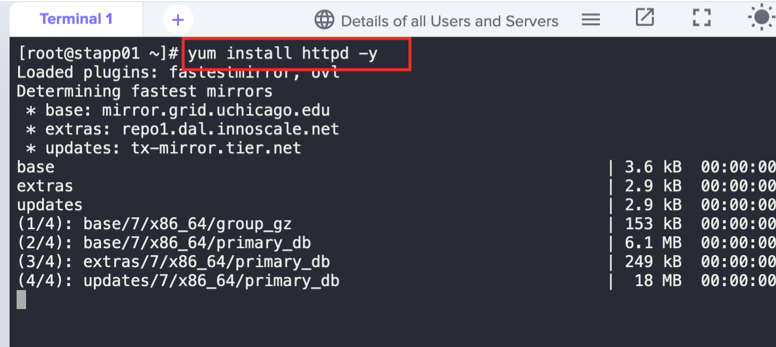
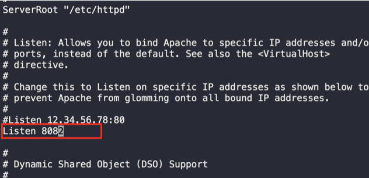
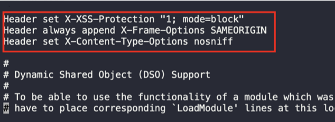
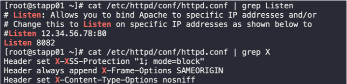
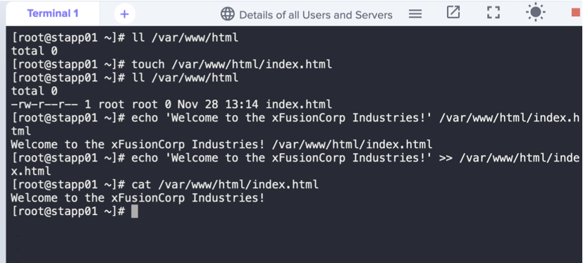
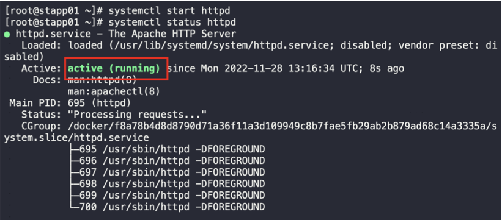
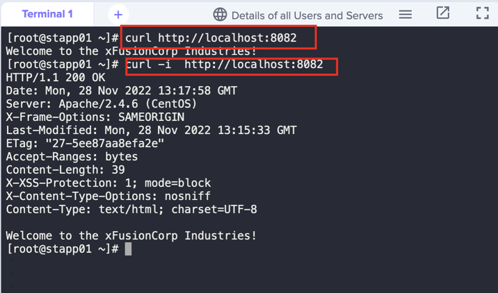

1. SSH into App server 1 & switch to root user
```
ssh tony@stapp01
sudo su -
```

2. Install httpd package on the server
```
yum install httpd -y
```



3. Edit httpd configuration file; change the port & add Headers at end
```
vi /etc/httpd/conf/httpd.conf
```







4. Create `index.html` file and echo the given content



5. Start htttpd.



6. Validate task by Curl

