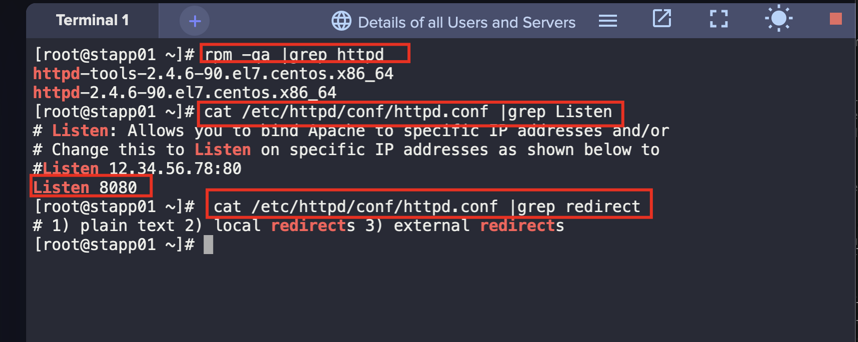
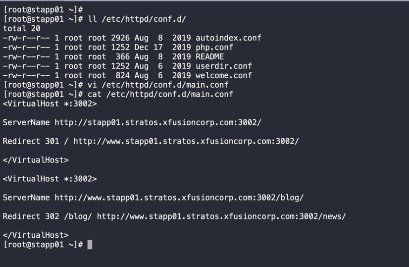
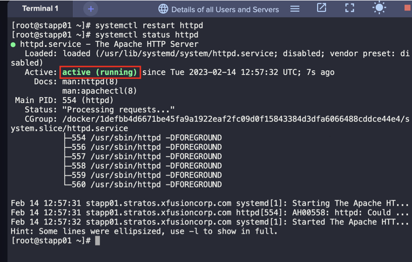
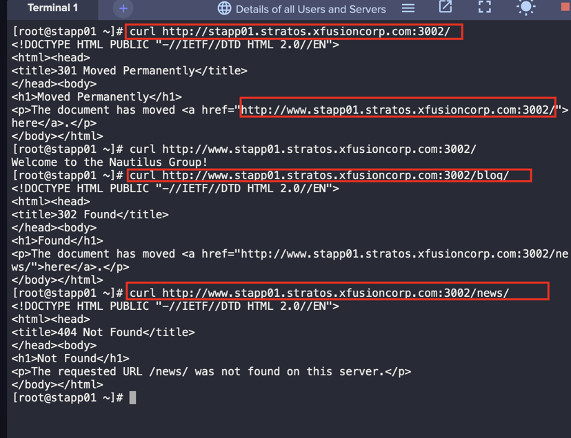

1. SSH into the server

2. Confirm Apache version and configuration
```
rpm -qa |grep httpd
cat /etc/httpd/conf/httpd.conf | grep Listen
cat /etc/httpd/conf/httpd.conf | grep redirect
```



3. Edit configuration file and change the port number
```
vi /etc/httpd/conf/httpd.conf
```


4. Create a `main.conf` file, then redirects the given URLs permanently and temporary
```
vi /etc/httpd/conf.d/main.conf

#Add the following configuration 
<VirtualHost *:3002>

ServerName http://stapp01.stratos.xfusioncorp.com:3002/
Redirect 301 / http://www.stapp01.stratos.xfusioncorp.com:3002/

</VirtualHost>
 
<VirtualHost *:3002>

ServerName http://www.stapp01.stratos.xfusioncorp.com:3002/blog/
Redirect 302 /blog/ http://www.stapp01.stratos.xfusioncorp.com:3002/news/

</VirtualHost>
```



5. Restart Apache
```
systemctl restart httpd
systemctl status httpd
```



6. Validate task using `curl`
```
curl http://stapp01.stratos.xfusioncorp.com:3002/
curl http://www.stapp01.stratos.xfusioncorp.com:3002/
curl http://www.stapp01.stratos.xfusioncorp.com:3002/blog/
curl http://www.stapp01.stratos.xfusioncorp.com:3002/news/
```

