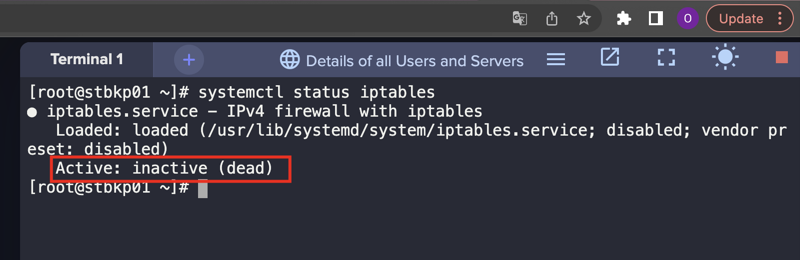
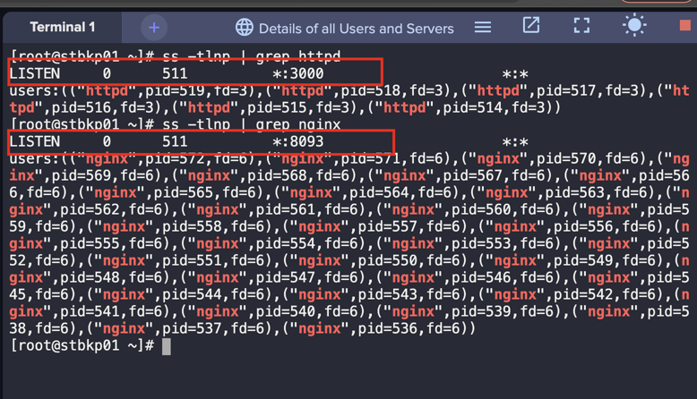
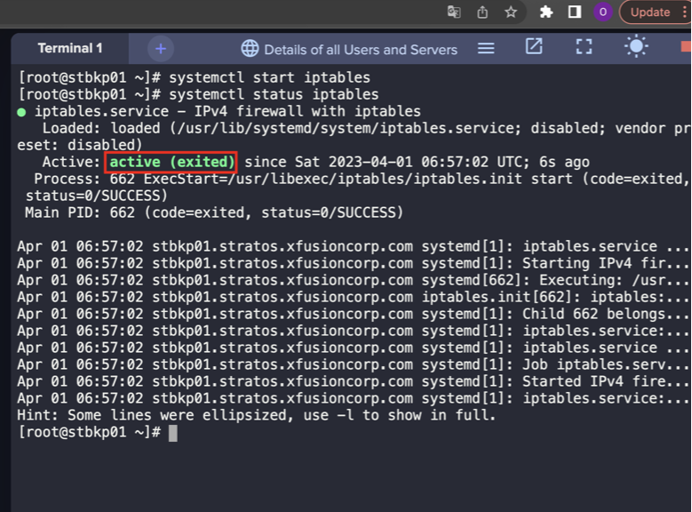
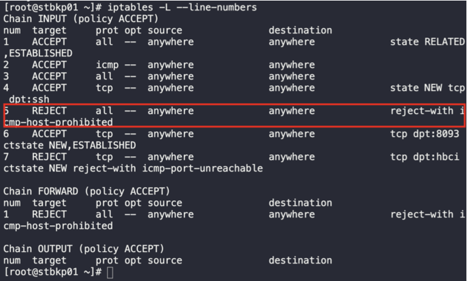
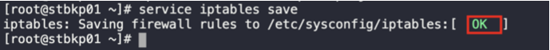
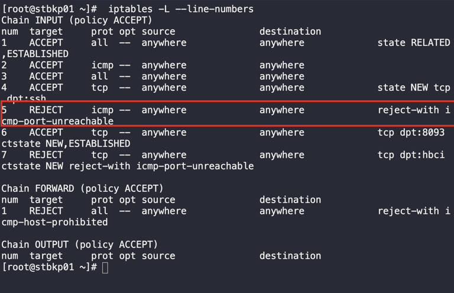
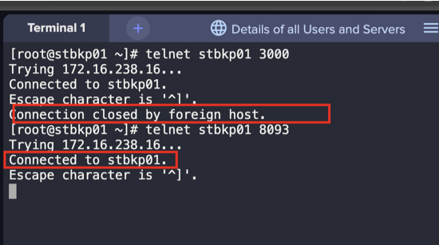

1. SSH into the backup server, and login as a root user

2. Check the iptables staus
```
systemctl status iptables
```


3. Check Apache and Nginx ports.
```
ss -tlnp | grep httpd
ss -tlnp | grep nginx
```


4. Start the iptables service



5. As per task, open the nginx port and block apache's to incoming connections
```
iptables -A INPUT -p tcp --dport 8093 -m conntrack --ctstate NEW,ESTABLISHED -j ACCEPT
iptables -A INPUT -p tcp --dport 3000 -m conntrack --ctstate NEW -j REJECT
```

6. Check and change the `icmp` Rule 5 for `prohibited` to `rejected`
```
iptables -L --line-numbers
```


```
iptables -R INPUT 5 -p icmp -j REJECT
```

```
service iptables save
```


```
iptables -L --line-numbers
```


7. Validate the reachabilty of the ports
```
telnet stbkp01 3000
telnet stbkp01 8093
```
