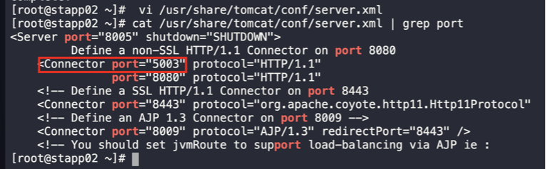
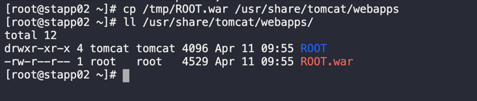
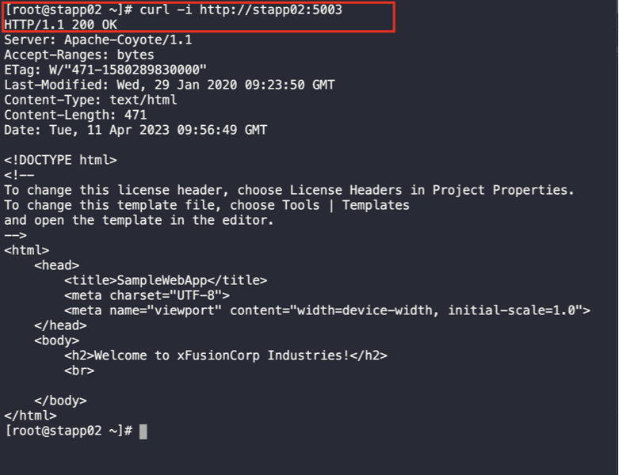

1. Copy the `war` file from jumphost to the app server
```
scp /tmp/ROOT.war steve@stapp02:/tmp
```

2. SSH into the app server, then login as root user
```
ssh steve@stapp02
sudo su -
```

3. Install Tomcat Packages
```
yum install tomcat
```

4. edit tomcat file to replace `Connector port of non-ssl` port
```
vi /usr/share/tomcat/conf/server.xml
cat /usr/share/tomcat/conf/server.xml | grep port
```


5. Copy the war file from `/tmp` to tomcat root directory
```
cp /tmp/ROOT.war /usr/share/tomcat/webapps
```


6. Start tomcat service and check status
```
systemctl start tomcat
systemctl status tomcat
```

7. Varify connection
```
curl -i http://stapp02:5003
```
