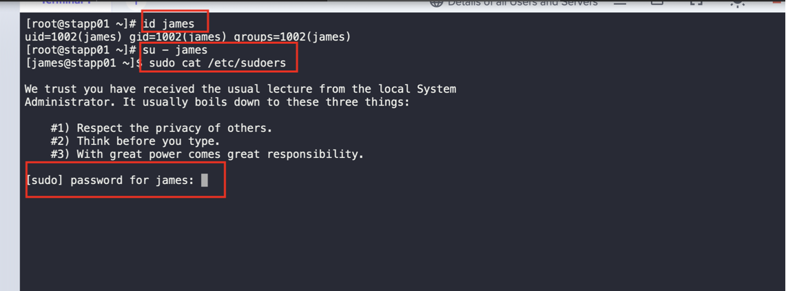
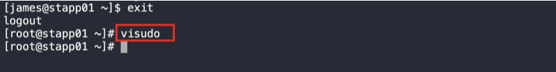
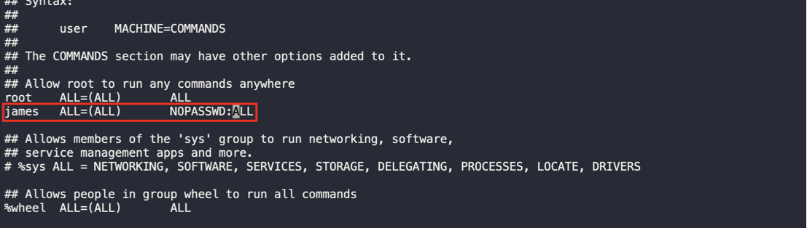
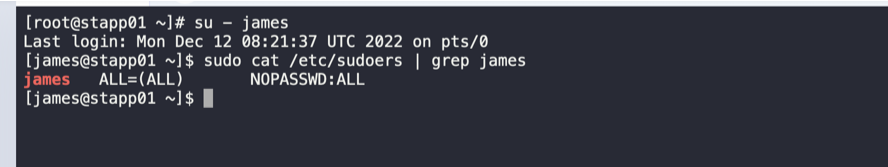

1. SSH into the app server
```
ssh tony@stapp01
sudo -i
```

2. Check user and its sudo permission
```
id james
su - james
sudo cat /etc/sudoers | grep james
```




3. Switch back to root user and provide sudo permission without password
```
visudo
```







4. Repeat these steps for other app servers