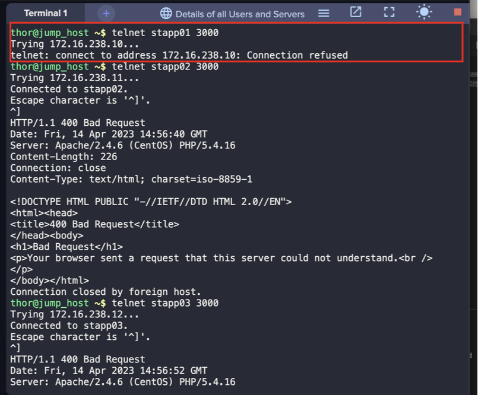
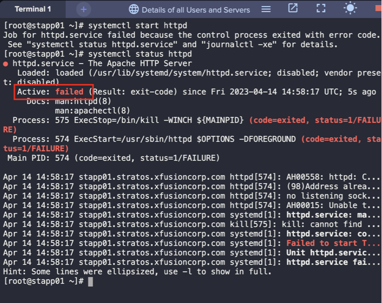
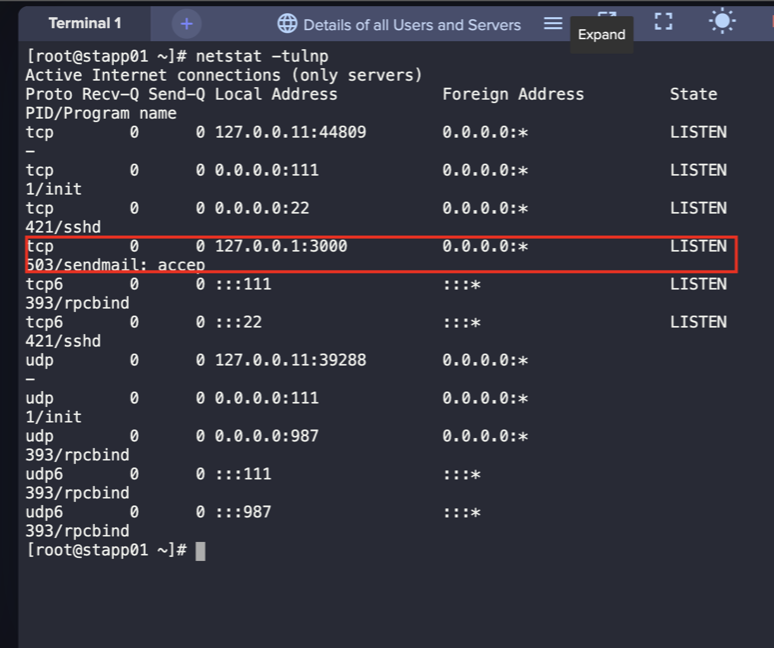
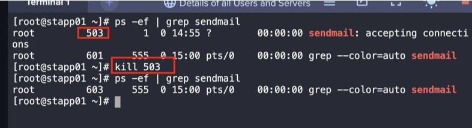
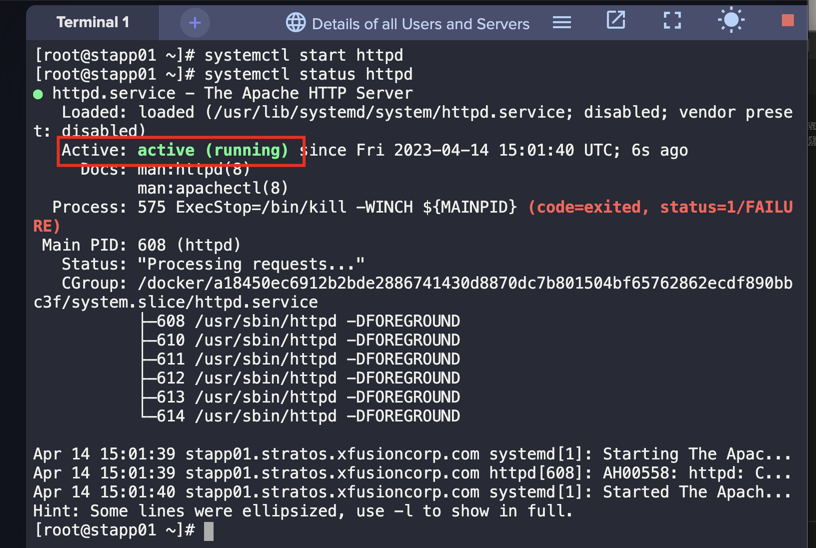
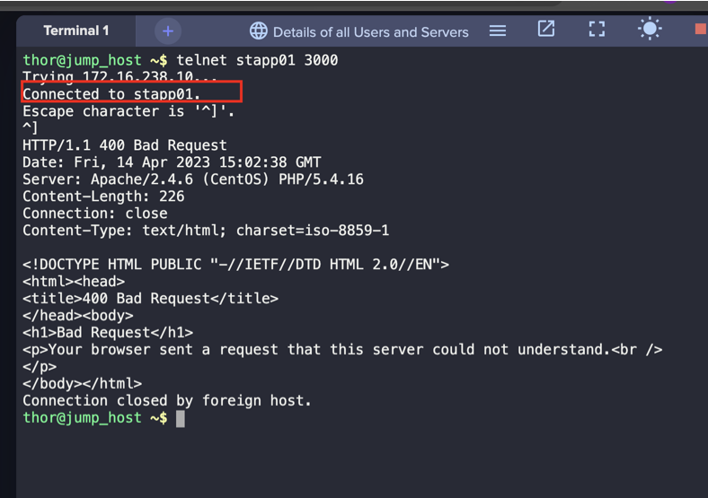

1. Identify the faulty server using `telnet`
```
telnet stapp01 3000
telnet stapp02 3000
telnet stapp03 3000
```



2. SSH into the faulty server (app server 1)
```
ssh tony@stapp01
sudo su -
```

3. Check if Apache HTTPD is running
```
systemctl start httpd
systemctl status httpd
```



4. Check the service using the port and its PID
```
netstat -tulnp
```



5. Confirm the PID as per the netstat output and kill the process
```
ps -ef | grep sendmail
kill {PID}
```



6. Start httpd service 
```
systemctl start httpd
systemctl status httpd
```



7. Validate the apache connection from jump server
```
telnet stapp01 3000
```
