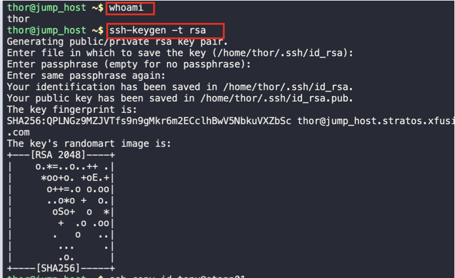
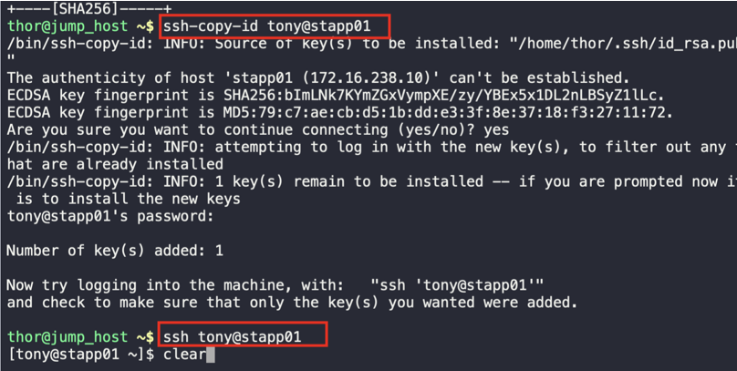

1. Check your login as thor user on the server, then generate an ssh key
```
whoami
ssh-keygen -t rsa
```



2. Copy the public key on the App Server
```
ssh-copy-id tony@stapp01
```
3. Login into the server without password



4. Repeat steps 2 and 3 in stapp02 and stapp03