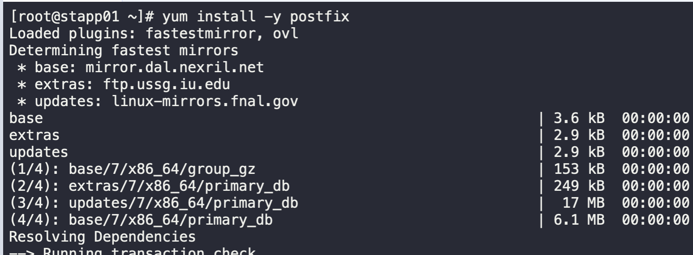
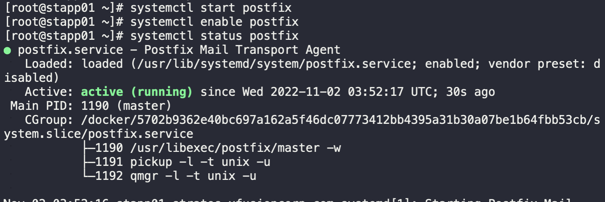

1. SSH into the application server
```
ssh tony@stapp01
sudo -i
```

2. Install postfix on appserver
```
yum install -y postfix
```


3. Edit the `main.cf` file, comment out `inet_interface=localhost` and uncomment `inet_interface=all`
```
vi /etc/postfix/main.cf
```

4. Start and enable Postfix Service
```
systemctl start postfix
systemctl enable postfix
systemctl status postfix
```


5. Repeat steps for server 2 and 3