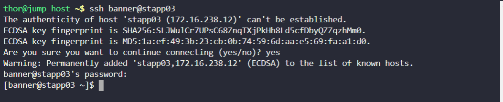
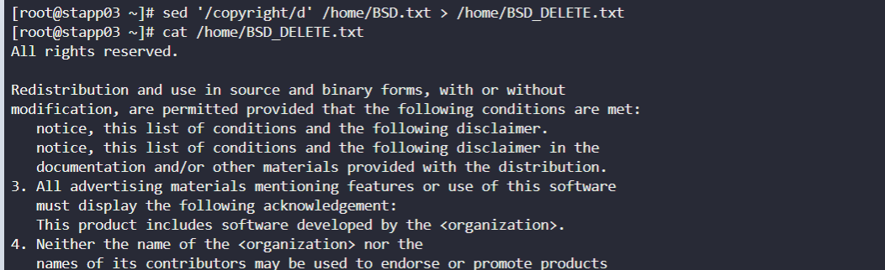
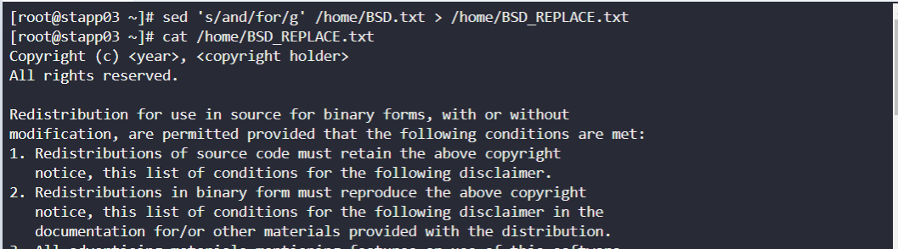
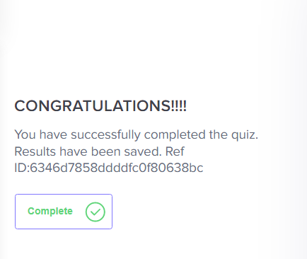

ssh into app-server 3

Delete the lines containing the word `copyright` in `/home/BSD.txt`, using `sed` command and save the output in `/home/BSD_DELETE.txt`

`sed '/copyright/d' /home/BSD.txt > /home/BSD_DELETE.txt`

Substitue the word `and` to `for` in `/home/BSD.txt` and save the output in `/home/BSD_REPLACE.txt`

`sed 's/and/for/g' /home/BSD.txt > /home/BSD_REPLACE.txt`

Submit task!

