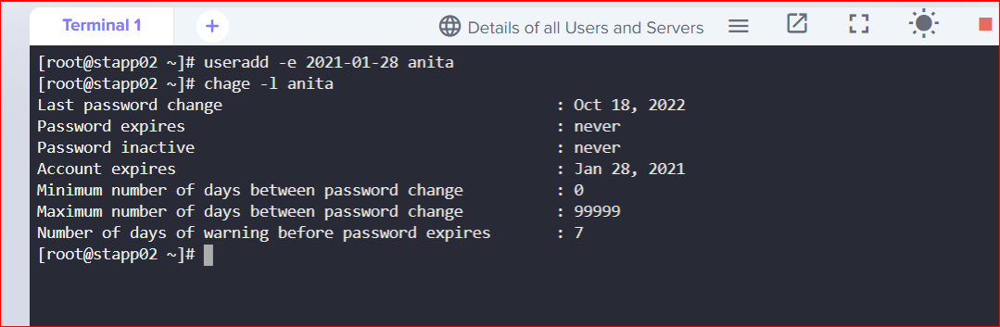

# Task

A developer anita has been assigned Nautilus project temporarily as a backup resource. As a temporary resource for this project, we need a temporary user for anita. It’s a good idea to create a user with a set expiration date so that the user won't be able to access servers beyond that point.

Therefore, create a user named anita on the App Server 2. Set expiry date to 2021-01-28 in Stratos Datacenter. Make sure the user is created as per standard and is in lowercase.

