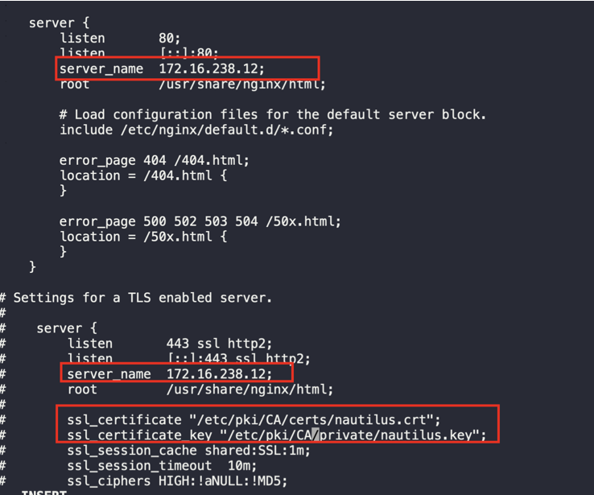
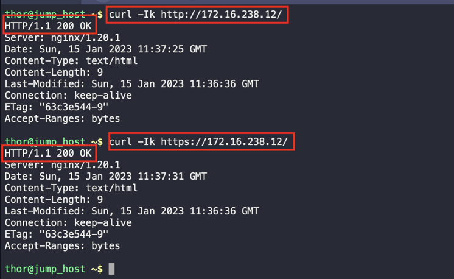

1. SSH into app server 3
```
ssh banner@stapp03
sudo su -
```

2. Install epel repo and Nginx package
```
yum install epel-release -y
yum install nginx -y
```

3. Copy the ssl certificate and key in the `/tmp`
```
cp /tmp/nautilus.crt /etc/pki/CA/certs/
cp /tmp/nautilus.key /etc/pki/CA/private/
```

4. Edit the Nginx conf file;
   * Add the `Server-Private-IP-Address`
   * Add the path to the ssl certificate `/etc/pki/CA/certs/nautilus.crt` and ssl key `/etc/pki/CA/private/`



5. In the Nginx document root, remove the `index.html` symbolic link
```
ll /usr/share/nginx/html/
rm /usr/share/nginx/html/index.html
```

6. Create an `index.html` with the word `Welcome!`
```
vi /usr/share/nginx/html/index.html
```

7. Start Nginx service
```
systemctl start nginx
systemctl status nginx
```

7. Validate connection using curl
```
curl -Ik https://<app-server-ip>/
curl -Ik http://<app-server-ip>/
```

