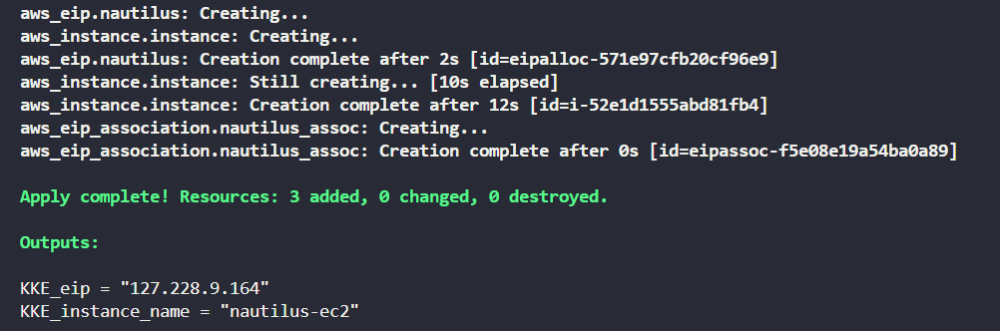

#### Task - Associate Elastic IP with EC2 Instance Using Terraform
---
Provision a new EC2 instance with a stable public IP using Terraform:
- Create an EC2 instance named `nautilus-ec2` (Linux AMI, t2.micro).
- Allocate and associate an Elastic IP named `nautilus-eip` to the instance.
- Use main.tf to define the resources.
- Output the instance name (`KKE_instance_name`) and Elastic IP (`KKE_eip`) in outputs.tf.

#### Solution - 
---
- [main.tf](./main.tf)
- [outputs.tf](./outputs.tf)

**Steps to Execute**

Initialize Terraform
```sh
terraform init
```
Validate the configuration
```sh
terraform validate
```
Preview the resources 
```sh
terraform plan
```
Apply the configuration
```sh
terraform apply 
```

Check **Outputs**
After apply, Terraform will display:

- KKE_instance_name -> Name of Instnace
- KKE_eip -> Elastic IP

