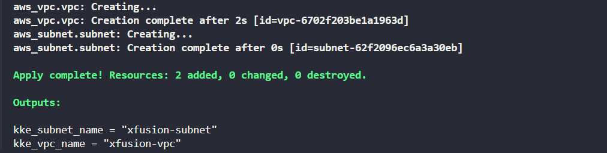

#### Task - Create VPC and Subnet Using Terraform
---
To ensure proper resource provisioning order, the DevOps team wants to explicitly define the dependency between an AWS VPC and a Subnet. The objective is to create a VPC and then a Subnet that explicitly depends on it using Terraform's depends_on argument.

The objective of this task is to:

- Create a VPC named xfusion-vpc.
- Create a Subnet named xfusion-subnet that explicitly depends on the VPC using depends_on.
- Use variables.tf to define variables.
- Use terraform.tfvars to input the VPC and Subnet names.
- Output the VPC and Subnet names in outputs.tf.

#### Solution - 
---

- [main.tf](./main.tf)
- [variables.tf](./variables.tf)
- [terraform.tfvars](./terraform.tfvars)
- [outputs.tf](./outputs.tf)

**Steps to Execute**

Initialize Terraform
```sh
terraform init
```
Validate the configuration
```sh
terraform validate
```
Preview the resources to be created
```sh
terraform plan
```
Apply the configuration
```sh
terraform apply -auto-approve
```

Check **Outputs**
After apply, Terraform will display:

- kke_vpc_name → Name of the created VPC
- kke_subnet_name → Name of the created Subnet

