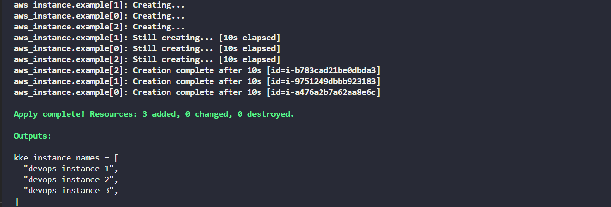

#### Task - Deploy Multiple EC2 Instances with Terraform
---
Create 3 EC2 instances using the count parameter. Name each EC2 instance with the prefix devops-instance (e.g., devops-instance-1). 
- Instances should be t2.micro. 
- The key named should be devops-key. 
- Create main.tf file (do not create a separate .tf file) to provision these instances. 
- Use variables.tf file with the following: `KKE_INSTANCE_COUNT:` number of instances. `KKE_INSTANCE_TYPE:` type of the instance. `KKE_KEY_NAME:` name of key used. `KKE_INSTANCE_PREFIX:` name of the instnace. 
- Use the locals.tf file to define a local variable named AMI_ID that retrieves the latest Amazon Linux 2 AMI using a data source. 
- Use terraform.tfvars to assign values to the variables. 
- Use outputs.tf file to output the following: kke_instance_names: names of the instances created.

#### Solution - 
---
#### Solution - 
---

- [main.tf](./main.tf)
- [locals.tf](./locals.tf)
- [variables.tf](./variables.tf)
- [terraform.tfvars](./terraform.tfvars)
- [outputs.tf](./outputs.tf)

**Steps to Execute**
```sh
terraform init
terraform validate
terraform plan
terraform apply
```

Check **Outputs**
After apply, Terraform will display:

- kke_instance_names -> Number of Instances created.

