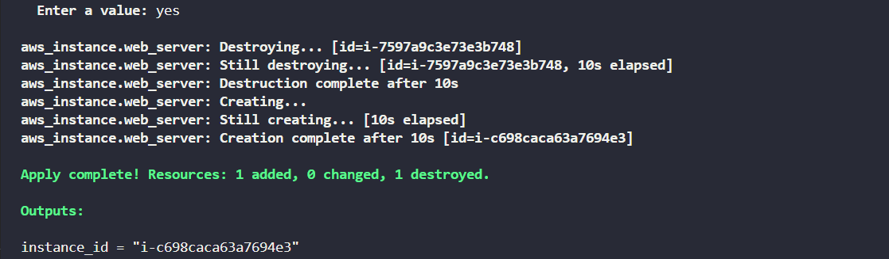

#### Task - Replace Existing EC2 Instance via Terraform
---
To test resilience and recreation behavior in Terraform, the DevOps team needs to demonstrate the use of the -replace option to forcefully recreate an EC2 instance without changing its configuration. Please complete the following tasks:
- Use the Terraform CLI -replace option to destroy and recreate the EC2 instance xfusion-ec2, even though the configuration remains unchanged.
- Ensure that the instance is recreated successfully.

#### Solution - 
---

- [main.tf](./main.tf)
- [variables.tf](./variables.tf)
- [terraform.tfvars](./terraform.tfvars)
- [outputs.tf](./outputs.tf)

**Steps to Execute**

**syntax** for -replace:
```sh
terraform apply -replace=RESOURCE_ADDRESS
```
- terraform apply -> runs Terraform to make changes.(we can also use -replace with plan as well)
- replace -> tells Terraform to destroy and recreate a resource even if nothing changed in config.
- RESOURCE_ADDRESS -> the full path/name of the resource from your Terraform code (e.g., aws_instance.web_server).

Initialize Terraform
```sh
terraform init
```
Validate the configuration
```sh
terraform validate
```
Preview the resources with -replace
```sh
terraform plan -replace=aws_instance.web_server
```
Apply the configuration
```sh
terraform apply -replace=aws_instance.web_server
```

Check **Outputs**
After apply, Terraform will display:

- instance_id -> Id of the recreated EC2

